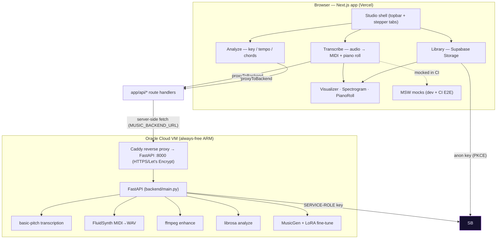

# Architecture & Build/Iterate Loop

How hello-ai is put together, and how to ship changes safely without manual QA.

## 1. System at a glance



> Rendered above is the canonical diagram. The browser never talks to the
> Oracle backend directly: all backend calls go through `app/api/*` →
> `lib/backend.ts` (`proxyToBackend`).

Key rule: **the browser never talks to the Oracle backend directly.** All backend
calls go through `app/api/*` → `lib/backend.ts` (`proxyToBackend`), which forwards
to `MUSIC_BACKEND_URL` (default `https://gricci-testing.duckdns.org`). This keeps
the VM URL/key off the client and lets Vercel be the only public edge.

## 2. The autonomous loop (design → build → test → ship)

This is the workflow that lets a high-level prompt become a merged, verified change
with no manual clicking:

```
   Prompt / issue
        │
        ▼
 ┌──────────────────┐
 │ 1. Design (SOT)  │  design/tokens.json + design/mockups/*.html = source of truth
 └────────┬─────────┘  (edit these, not ad-hoc CSS, when the look must change)
          ▼
 ┌──────────────────┐
 │ 2. Implement     │  Components read design tokens (app/globals.css :root)
 │                  │  + primitive classes (.btn .chip .panel .drop-zone …).
 │                  │  New feature = new component in components/<feature>/.
 └────────┬─────────┘
          ▼
 ┌──────────────────────────────────────────────────────────────────┐
 │ 3. PR opened → CI runs TWO checks                                  │
 │                                                                    │
 │   • build  (REQUIRED, blocks merge)                                │
 │       - npm run build                                              │
 │       - starts the app, runs Playwright E2E journeys               │
 │         (tests/e2e/journey.spec.ts):                               │
 │           - Transcribe upload → sheet music renders + MIDI download│
 │           - Library upload via drop zone → "Saved ✓"               │
 │       → if a core user flow breaks, the PR CANNOT merge.          │
 │                                                                    │
 │   • argos  (NON-blocking, informational)                           │
 │       - screenshots the mockup + built app, diffs vs main          │
 │       - posts visual drift on the PR for human review             │
 └────────┬─────────────────────────────────────────────────────────┘
          ▼
   Merge to main → Vercel auto-deploys → working app link ready.
```

### Why this is "autonomous enough"
- **Functional regressions are caught by `build`** (the E2E journeys exercise the
  real Transcribe + Library paths). A broken flow can't reach `main`.
- **Visual drift is caught by `argos`** (non-blocking so it never stalls a merge,
  but always visible for review).
- The human only opens the deployed link to give high-level direction; the agent
  designs, implements, and verifies.

### Required vs optional checks
| Check   | Required to merge? | What it guards |
|---------|-------------------|----------------|
| `build` | ✅ yes            | App compiles + core journeys pass |
| `argos` | ❌ no             | Visual diff vs baseline (review signal) |

> Branch protection on `main` requires the `build` status check + `enforce_admins`.
> Argos is intentionally NOT in the required list.

## 3. Where things live

| Concern            | Path |
|--------------------|------|
| Page shell         | `components/Studio.tsx` (topbar + stepper tabs) |
| Transcribe         | `components/transcribe/index.tsx`, `components/PianoRoll.tsx`, `lib/music.ts`, `lib/notes.ts` |
| Analyze            | `components/analyze/index.tsx`, `lib/analyze.ts`, `lib/notes.ts` |
| Library            | `components/library/index.tsx`, `components/Visualizer.tsx`, `components/Spectrogram.tsx`, `lib/storage.ts` |
| Canvas helpers     | `lib/canvas.ts` (shared `withAlpha` / CSS-var resolvers) |
| Backend proxy      | `lib/backend.ts`, `app/api/**/route.ts` |
| Supabase client    | `lib/supabase.ts` (browser, anon; PKCE; graceful fallback) |
| Design SOT         | `design/tokens.json`, `design/mockups/*` |
| E2E journeys       | `tests/e2e/journey.spec.ts`, `tests/e2e/user-paths.spec.ts` |
| Visual QA          | `tests/visual/preview.spec.ts`, `.github/workflows/argos.yml` |
| CI gate            | `.github/workflows/ci.yml` |
| Backend (VM code)  | `backend/` (FastAPI) — separate deploy, not on Vercel |

## 4. Adding a feature

1. Create `components/<feature>/index.tsx` exporting a default component.
2. Add it to the grid in `components/Studio.tsx` (or add a new column).
3. If it needs backend work, add an `app/api/<feature>/route.ts` proxy + backend
   endpoint. If it needs storage, add a bucket + RLS policy in Supabase.
4. Add an E2E journey in `tests/e2e/journey.spec.ts` if it's a core flow.
5. Open PR → `build` must pass.

## 5. Data model (Supabase)

Storage buckets (see `supabase/migrations/` for RLS; some allow anon
insert/select so the app works without login):
`library`, `midi`, `audio`, `transcriptions`, `enhanced`, `analysis`,
`datasets`, `adapters`. Note: `tracks` is a **database table**, not a bucket;
the `enhanced` and `analysis` buckets exist but are not currently written by
the backend.
DB tables (backend-written, service-role): `jobs`, `models`, `tracks`.
Migrations live in `supabase/migrations/`.
